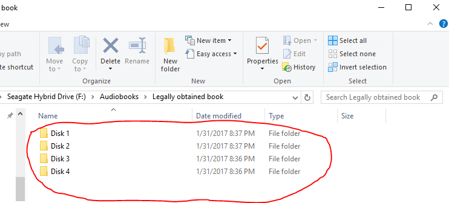
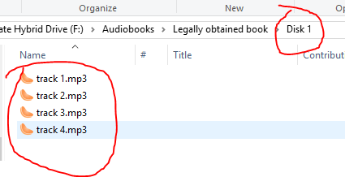

# RenameFilesAs-Folder_File
Takes a directory of subfolders and renames the files in the subfolders as 'subfolder_filename' then moves the files up &amp; out of the subfolder before deleting the subfolder

##Look at all these folders!!! Argh!

##Look at these non-unique names!! Bleh!

##Oh no, the 2nd folder has the same filenames. What to do!?!?

##Ah, that's better.

